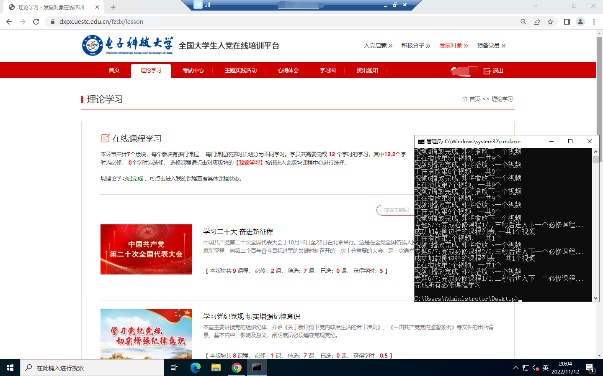
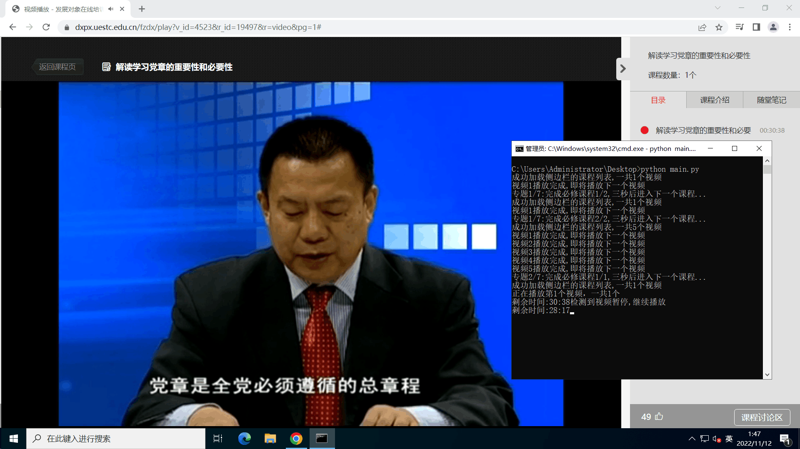
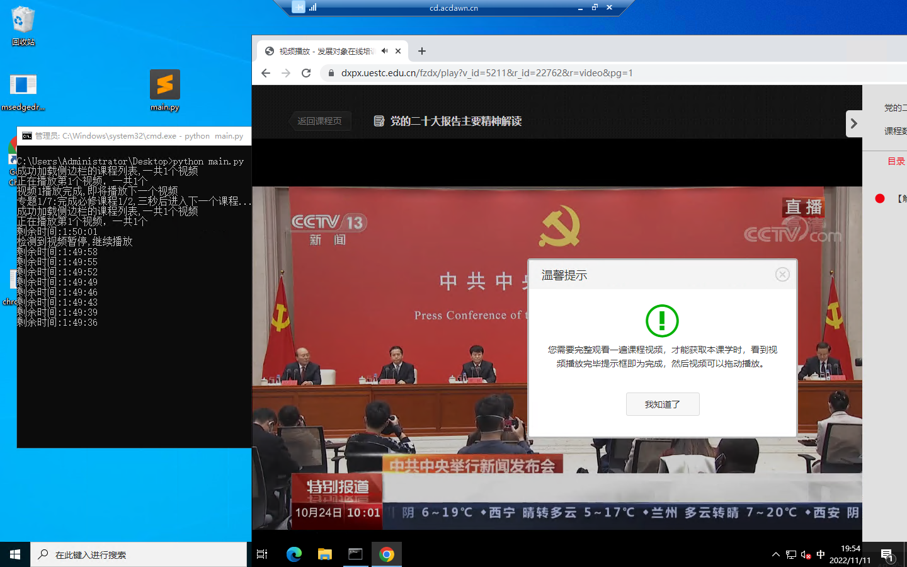
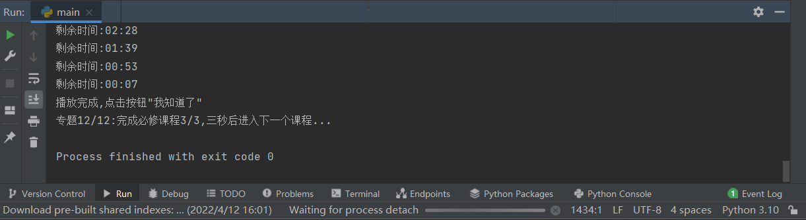

# 电子科技大学/UESTC积极分子培训视频自动播放脚本

## 写在最前

由于无积极分子的账号,没办法进行维护(去年可行),故积极分子课程的代码可能存在相关问题

发展对象课程是经过测试的

**本项目仅供技术学习交流,为此引出的任何与技术无关的问题与作者本人无关**

## 原理分析

​		python 的selenium 库可模拟人的行为去操作浏览器, 是web自动化测试工具, 同时也可定制一些特定脚本去模拟人观看视频.

​		selenium的使用需要用到浏览器驱动,此处以chrome为例进行测试.

## 成果演示

## 实现过程(发展对象)以Chrome为例

1. 基础环境安装

* python

* selenium

  `pip install selenium`

* chrome

  * 查看chrome版本:

    在chrome地址栏输入chrome://version,第一行即是版本

  * 根据chrome版本下载驱动?

  * 在https://chromedriver.storage.googleapis.com/index.html

    中找到对应chrome版本的驱动(版本号相近即可),

    下载"chromedriver_win32.zip",将里面的"chromedriver.exe"放到与fzdx.py同一目录下

2. 安装完selenium和python后,将驱动安放好位置,还需要进行一些额外配置

   首先将chrome安装目录"C:\Program Files\Google\Chrome\Application"(默认为这个,需要根据你的电脑自行查找)添加到环境变量path,添加过程详见百度

   接着按下win+R,输入命令

   `chrome.exe --remote-debugging-port=9222 --user-data-dir="D:/selenium_test"`

   会打开浏览器调试窗口

3. 打开[课程网址](https://dxpx.uestc.edu.cn/),然后登录,然后进入`https://dxpx.uestc.edu.cn/fzdx/lesson`
4. 运行`fzdx.py`

## 实现过程(积极分子)

前两步骤同上

1. 打开[课程网址](https://dxpx.uestc.edu.cn/),然后登录,登录后进入如下界面

2. 运行`python jjfx.py`

## 注意问题

1.不要最小化浏览器,推荐在夜晚刷视频.

2.脚本虽设置检测暂停之后自动播放,但有时会遇到网站一直暂停的情况,此时需要点击浏览器聚焦

3.最好不要在调试浏览器的窗口新开标签页

4.无第三方题库接口,目前打算利用爬虫爬取题库,人工录入答案.

5.可使用浏览器插件global speed(同时点击设置,开启幽灵模式),开始16倍速,更为方便(**但是注意,这个最好不要使用倍速,因为后台可能会统计时长**).

## 注意!!!

**本项目仅供技术学习交流,为此引出的任何与技术无关的问题与作者本人无关**

## 联系作者

如遇任何技术问题请联系qq2638177031

我的博客:https://blog.acdawn.cn
