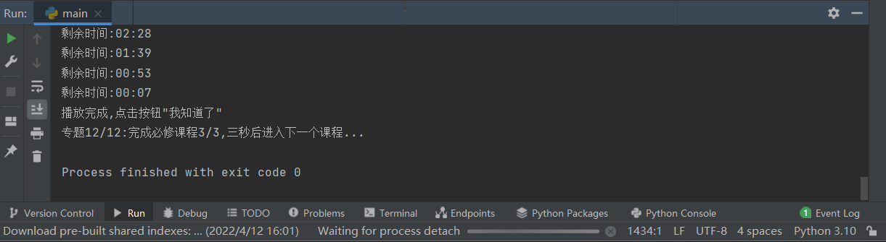

# 电子科技大学/UESTC积极分子培训视频自动播放脚本

## 原理分析

​		python 的selenium 库可模拟人的行为去操作浏览器, 是web自动化测试工具, 同时也可定制一些特定脚本去模拟人观看视频.

​		selenium的使用需要用到浏览器驱动,此处以chrome为例进行测试.

## 环境配置与搭建

​	python:3.10

​	selenium:4.1.3

> 如何安装selenium?
>
> 在pycharm的Terminal(终端)执行pip install selenium

​	chrome:100.0.4896.75

> ​	如何查看chrome版本?
>
> 在chrome地址栏输入chrome://version,第一行即是版本

​	chrome驱动:100.0.4896.60

> 如何根据下载驱动?
>
> https://chromedriver.storage.googleapis.com/index.html在网址中找到对应chrome版本的驱动(版本号相近即可),
>
> 下载"chromedriver_win32.zip",将里面的"chromedriver.exe"放到与main.py同一目录下

## 成果演示

## 实现过程

1.安装完selenium和python后,将驱动安放好位置,还需要进行一些额外配置

> 首先将chrome安装目录"C:\Program Files\Google\Chrome\Application"(默认为这个,需要根据你的电脑自行查找)添加到环境变量path,添加过程详见百度
>
> 接着按下win+R,输入命令
>
> `chrome.exe --remote-debugging-port=9222 --user-data-dir="D:/selenium_test`
>
> 会打开浏览器调试窗口

2.我们首先需要在上一步打开的窗口人为登录,进入如下界面(若使用selenium登录需要用到验证码,而验证码的识别需要第三方接口...付费,因此略去)

3.接下来运行程序

## 注意问题

1.不要最小化浏览器,推荐在夜晚刷视频.

2.脚本虽设置检测暂停之后自动播放,但有时会遇到网站一直暂停的情况,此时需要点击浏览器聚焦

3.最好不要在调试浏览器的窗口新开标签页

4.无第三方题库接口,目前打算利用爬虫爬取题库,人工录入答案.

5.可使用浏览器插件global speed(同时点击设置,开启幽灵模式),开始16倍速,更为方便.

## 联系作者

如遇任何问题请联系qq2638177031